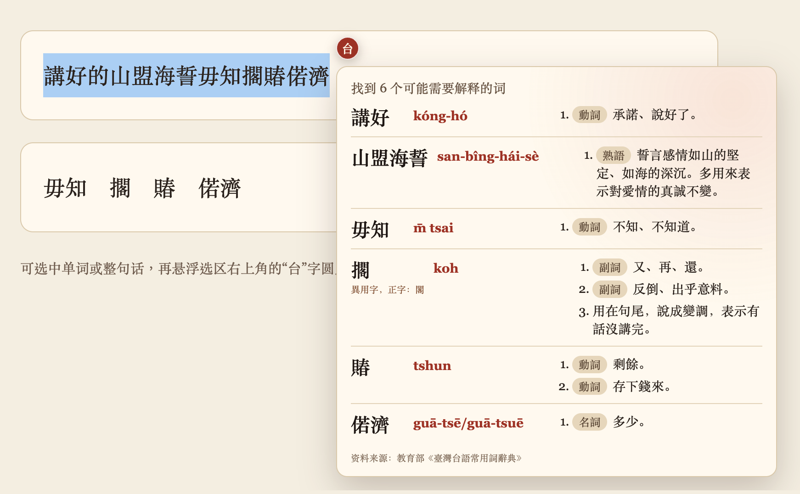
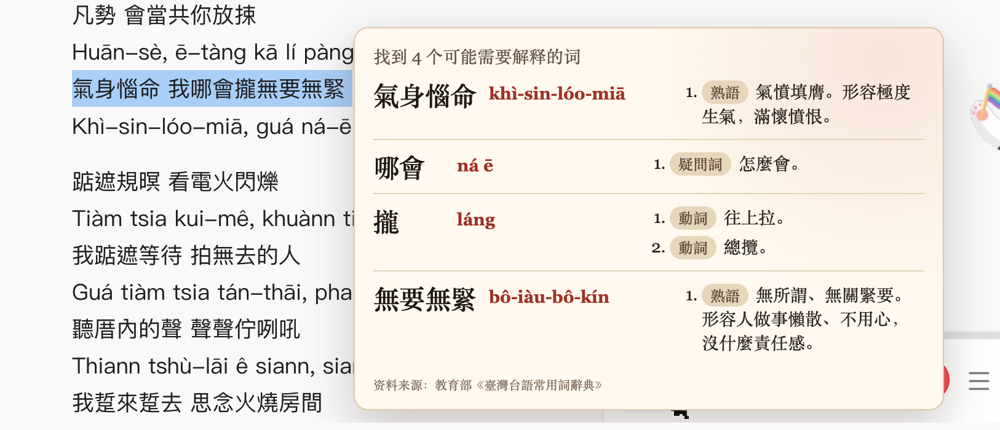
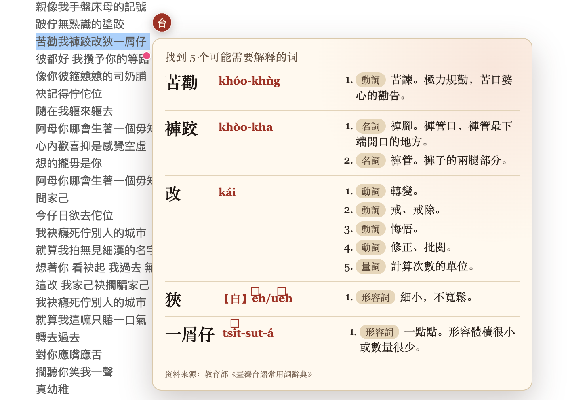

# 闽南语小工具

Chrome 上的闽南语查询小工具。选中网页里的词语或句子，悬浮选区旁的“台”字圆点，即可查看读音、释义和正字信息。

当前支持：

- 单词精确查询
- 句子中的词典词目提取
- ODS 异用字查询及正字提示
- 完全本地查询，不上传选中文字

## 预览







## 准备

```bash
npm install
```

该命令会准备 fflate 浏览器文件和教育部 `kautian.ods`。

## 加载

1. 打开 `chrome://extensions`。
2. 开启“开发者模式”。
3. 点击“加载已解压的扩展程序”。
4. 选择本仓库目录。
5. 在普通网页中选中闽南语词语或句子。
6. 悬浮选区右上角出现的“台”字圆点。

## 自动调试

```bash
npm run test:extension
```

脚本会启动独立 Chromium、加载扩展，并验证单词查询、整句词目提取和异用字提示。

## 数据来源

教育部《臺灣台語常用詞辭典》：<https://sutian.moe.edu.tw/zh-hant/>

## 隐私与授权

- [隐私政策](PRIVACY.md)
- [第三方资料与开源软件声明](THIRD_PARTY_NOTICES.md)
- [Chrome Web Store 上架材料](CHROME_WEB_STORE.md)
- 本项目代码采用 [MIT License](LICENSE)
